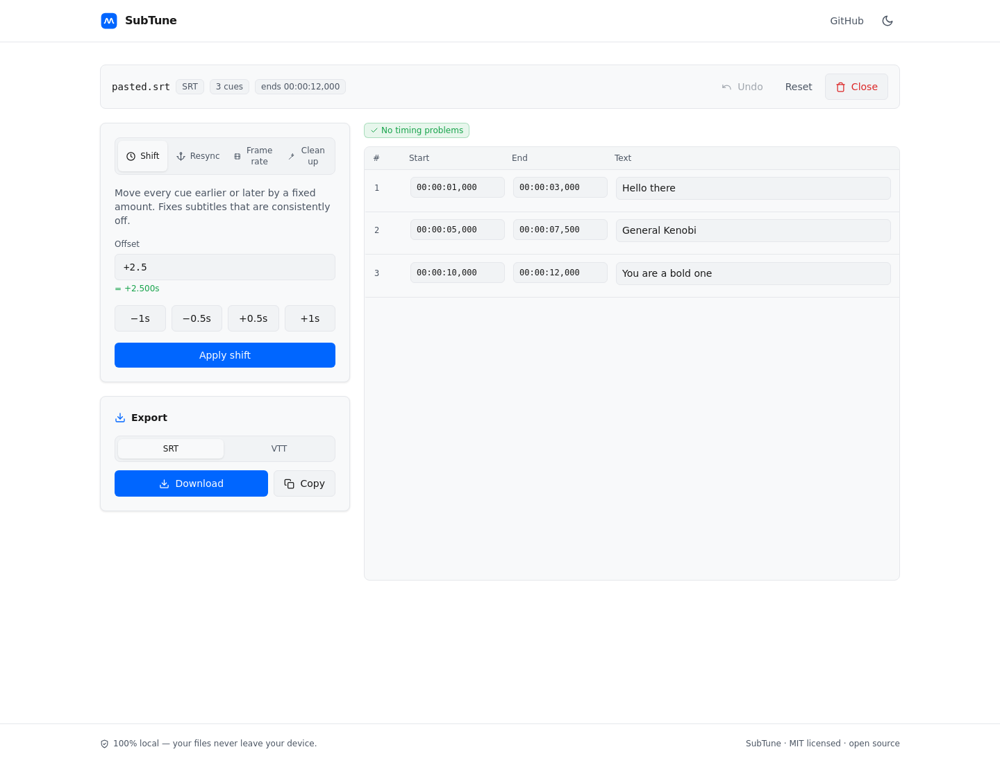
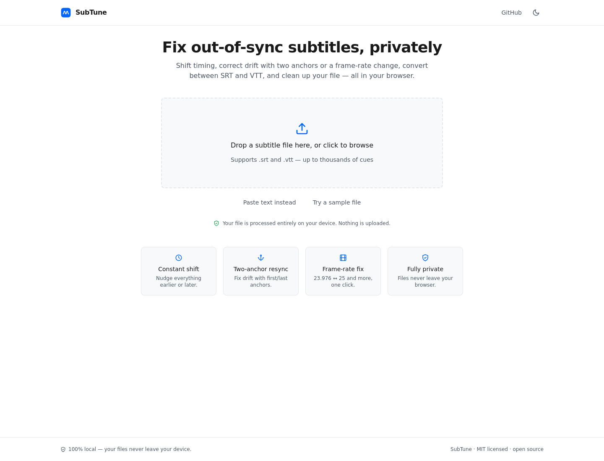
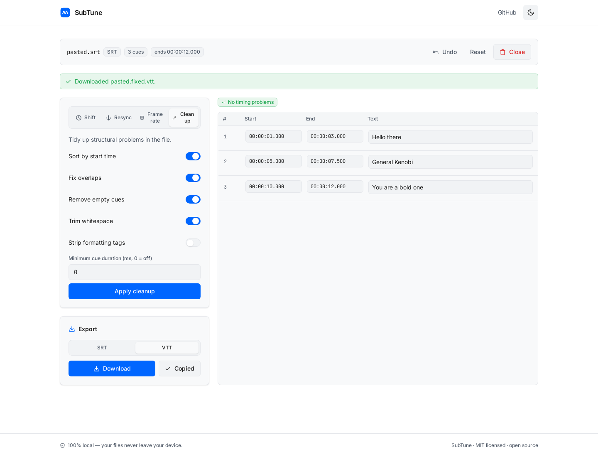
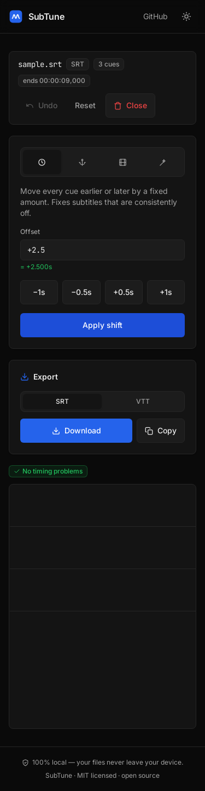

<div align="center">

# SubTune

### Fix out-of-sync subtitles — right in your browser, completely private.

Shift timing, correct drift with two anchors or a frame-rate change, convert between SRT and
VTT, clean up messy files, and edit any cue by hand. **Your files never leave your device.**

[**▶ Live app**](https://skytuhua.github.io/subtune/) · [Report a bug](https://github.com/Skytuhua/subtune/issues)



</div>

---

## Why SubTune?

You downloaded a movie and a subtitle file, and they don't line up. Two things usually break:

- **A constant offset** — subtitles are a few seconds early or late the whole way through.
- **Progressive drift** — they start fine and slowly desync, almost always because the
  subtitle was timed for a different frame rate (the classic 25 fps vs 23.976 fps mismatch).

The desktop gold standard for fixing this (Subtitle Edit) is **Windows-only**, and most online
tools each do just *one* of these, are closed-source, and quietly upload your file to a server.

**SubTune does all of it in one place, in your browser, with nothing uploaded** — and it's open
source.

## Features

- **Constant shift** — move every cue earlier/later (`+2.5`, `-1.2s`, `250ms`, `-0:02.500`).
- **Two-anchor linear resync** — give the *correct* time for the first and last lines and it
  stretches everything between, fixing offset **and** drift at once.
- **Frame-rate conversion** — one-click presets (23.976 ↔ 25, 24 ↔ 25, 29.97, …) plus custom fps.
- **SRT ↔ VTT conversion** — import either, export either.
- **Cleanup** — sort, fix overlaps, remove empty cues, trim whitespace, strip formatting tags,
  enforce a minimum duration, renumber.
- **Editable cue table** with live validation (overlaps, out-of-order, non-positive durations).
- **Undo / reset**, copy-to-clipboard, dark & light themes, fully responsive.
- **100% local & offline-capable** — no uploads, no tracking, self-hosted fonts, no backend.

## Screenshots

| Landing | Editor (light) | Mobile |
|---|---|---|
|  |  |  |

## Quick start

```bash
git clone https://github.com/Skytuhua/subtune.git
cd subtune
npm install
npm run dev          # http://localhost:5173/subtune/
```

### Build & preview

```bash
npm run build        # outputs static site to dist/
npm run preview      # serve the production build locally
```

The build is a fully static site — host the `dist/` folder anywhere (GitHub Pages, Netlify,
Vercel, an S3 bucket, or just open it locally). For a root-path host, build with `BASE_PATH=/`:

```bash
BASE_PATH=/ npm run build
```

## How the resync math works

All times are handled as integer milliseconds.

- **Shift:** `t' = t + Δ` (clamped at 0).
- **Two-anchor resync:** given two cues whose current times are `t₁, t₂` and whose correct
  times should be `t₁', t₂'`, SubTune solves the affine map `t' = a·t + b` with
  `a = (t₂' − t₁') / (t₂ − t₁)` and applies it to every cue — correcting offset (`b`) and
  drift (`a`) together.
- **Frame-rate:** `t' = t · (sourceFps / targetFps)`.

## Usage examples

- **Subtitles 2.5s late:** Shift tab → `-2.5` → Apply → Download.
- **Drift from a PAL speed-up:** Frame rate tab → `25 → 23.976` → Apply.
- **Don't know the frame rates:** Resync tab → type the correct time for the first and last
  lines (read them off the video) → Apply linear resync.
- **Convert + tidy:** load an `.srt`, enable cleanup toggles, pick **VTT**, Download.

## Tech

React 18 · TypeScript · Vite · Tailwind CSS · Vitest. The correctness-critical engine lives in
[`src/lib/`](src/lib) as pure, framework-free functions with full unit-test coverage. See
[`ARCHITECTURE.md`](ARCHITECTURE.md).

## Development

```bash
npm test             # 49 unit tests (Vitest)
npm run lint         # ESLint
node scripts/qa.mjs  # end-to-end browser QA (17 checks; needs `npm run preview` running)
```

## Limitations

- Supports **SRT** and **VTT** only (no ASS/SSA, SUB, SBV, STL yet).
- No audio/speech-based *automatic* sync — resync is anchor/offset/frame-rate based.
- No embedded video player; you read correct times off your own player.

## Privacy

SubTune is a static, client-side app. Subtitle files are read and processed entirely in your
browser with the `FileReader`/`Blob` APIs and are **never uploaded**. Fonts are bundled with the
app, so it makes **no third-party network requests** and works offline. (Verified by the QA
suite, which asserts zero off-host requests.)

## License

[MIT](LICENSE) © Skytuhua
